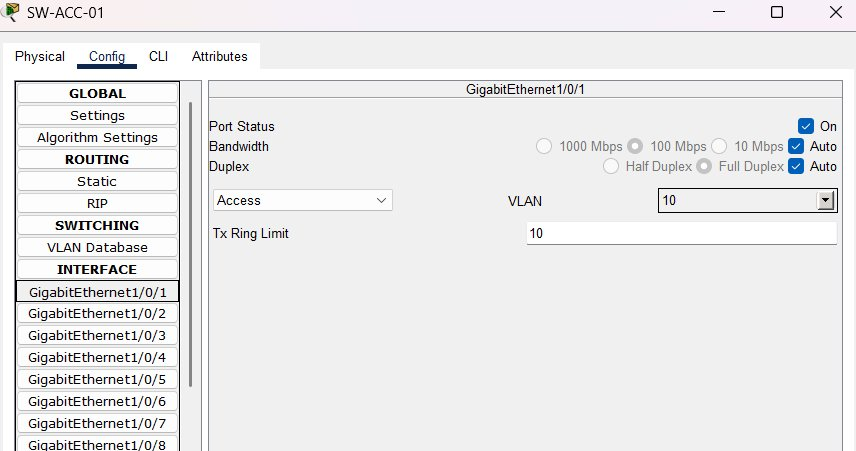
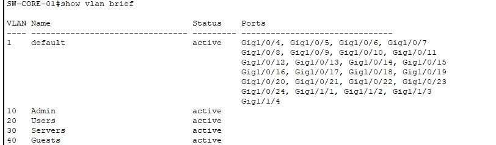
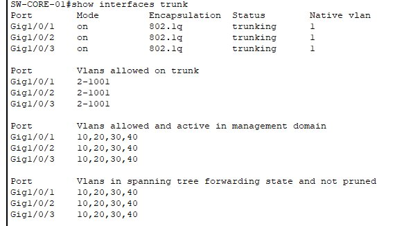
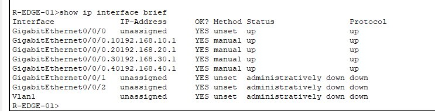
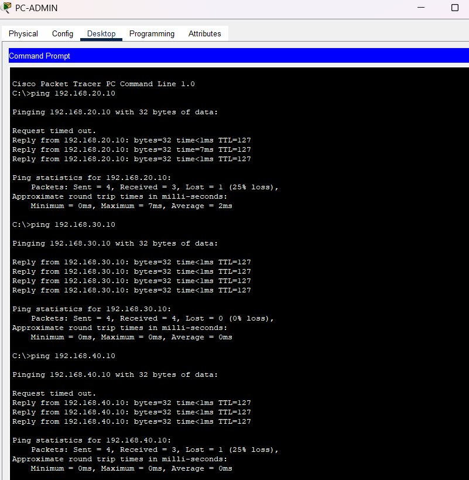
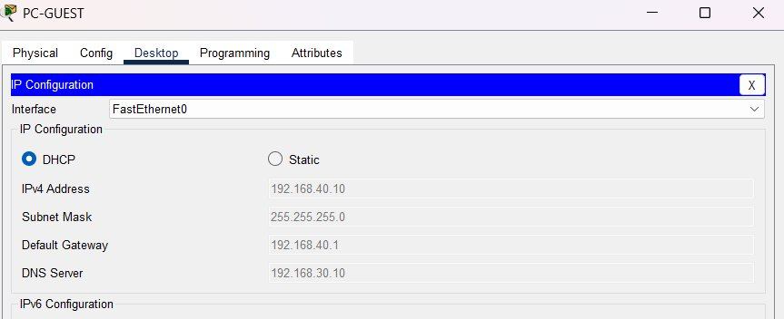

# 01 — VLAN Segmentation with Inter-VLAN Routing


Network segmentation lab with 4 VLANs, inter-VLAN routing using router-on-a-stick, dedicated DHCP server, DHCP relay and port security. Designed to simulate a real enterprise network infrastructure.

---

## Table of Contents

- [Topology](#topology)
- [Devices](#devices)
- [IP Addressing](#ip-addressing)
- [Configuration](#configuration)
- [Verification](#verification)
- [Troubleshooting](#troubleshooting)

---

## Topology


```
                        R-EDGE-01 (ISR 4331)
                             │
                        Gi0/0/0 (trunk)
                             │
                        SW-CORE-01 (3650-24PS)
                      /      │       \
                Gi1/0/1   Gi1/0/2   Gi1/0/3
                   │                  │
             SW-ACC-01            SW-ACC-02
            (3650-24PS)          (3650-24PS)
            /         \           /        \
       Gi1/0/1     Gi1/0/2   Gi1/0/1    Gi1/0/2
          │            │         │           │
       PC-ADMIN    PC-USER   PC-GUEST   DHCP-SERVER
       (VLAN10)   (VLAN20)  (VLAN40)    (VLAN30)

Trunk links: SW-ACC-01 Gi1/0/24 → SW-CORE-01
             SW-ACC-02 Gi1/0/24 → SW-CORE-01
```

---

## Devices

| Device | Model | Role |
|---|---|---|
| R-EDGE-01 | Cisco ISR 4331 | Router-on-a-stick, DHCP relay |
| SW-CORE-01 | Cisco 3650-24PS | Core switch, trunk links |
| SW-ACC-01 | Cisco 3650-24PS | Access switch, VLAN 10 & 20 |
| SW-ACC-02 | Cisco 3650-24PS | Access switch, VLAN 30 & 40 |
| DHCP-SERVER | Server-PT | Dedicated DHCP server |
| PC-ADMIN | PC-PT | VLAN 10 Administration client |
| PC-USER | PC-PT | VLAN 20 Users client |
| PC-GUEST | PC-PT | VLAN 40 Guests client |

---

## IP Addressing

### VLANs and subnets

| VLAN | Name | Network | Gateway | DHCP Range |
|---|---|---|---|---|
| 10 | Admin | 192.168.10.0/24 | 192.168.10.1 | .10 – .100 |
| 20 | Users | 192.168.20.0/24 | 192.168.20.1 | .10 – .100 |
| 30 | Servers | 192.168.30.0/24 | 192.168.30.1 | Static only |
| 40 | Guests | 192.168.40.0/24 | 192.168.40.1 | .10 – .50 |

### Static IPs

| Device | IP | VLAN |
|---|---|---|
| R-EDGE-01 Gi0/0/0.10 | 192.168.10.1 | 10 |
| R-EDGE-01 Gi0/0/0.20 | 192.168.20.1 | 20 |
| R-EDGE-01 Gi0/0/0.30 | 192.168.30.1 | 30 |
| R-EDGE-01 Gi0/0/0.40 | 192.168.40.1 | 40 |
| DHCP-SERVER | 192.168.30.10 | 30 |

---

## Configuration

### 1. VLANs on all switches

Applied on SW-CORE-01, SW-ACC-01 and SW-ACC-02:

```cisco
vlan 10
 name Admin
vlan 20
 name Users
vlan 30
 name Servers
vlan 40
 name Guests
```

### 2. Access ports

> In the Packet Tracer version used, the 3650-24PS exposes all ports as **GigabitEthernet1/0/X**. Both access and trunk ports are configured within this range.

**SW-ACC-01:**
```cisco
interface GigabitEthernet1/0/1
 switchport mode access
 switchport access vlan 10
 description PC-ADMIN

interface GigabitEthernet1/0/2
 switchport mode access
 switchport access vlan 20
 description PC-USER
```

**SW-ACC-02:**
```cisco
interface GigabitEthernet1/0/1
 switchport mode access
 switchport access vlan 40
 description PC-GUEST

interface GigabitEthernet1/0/2
 switchport mode access
 switchport access vlan 30
 description DHCP-SERVER
```

### 3. Trunk links

Port **Gi1/0/24** is used as the trunk uplink on access switches toward SW-CORE-01, keeping uplinks visually separated from access ports.

**SW-CORE-01:**
```cisco
interface GigabitEthernet1/0/1
 switchport mode trunk
 switchport trunk allowed vlan 10,20,30,40
 description TRUNK-SW-ACC-01

interface GigabitEthernet1/0/2
 switchport mode trunk
 switchport trunk allowed vlan 10,20,30,40
 description TRUNK-SW-ACC-02

interface GigabitEthernet1/0/3
 switchport mode trunk
 switchport trunk allowed vlan 10,20,30,40
 description TRUNK-R-EDGE-01
```

**SW-ACC-01 and SW-ACC-02:**
```cisco
interface GigabitEthernet1/0/24
 switchport mode trunk
 switchport trunk allowed vlan 10,20,30,40
 description TRUNK-SW-CORE-01
```

### 4. Router-on-a-stick (R-EDGE-01)

The physical interface carries no IP address. Each subinterface acts as the default gateway for its VLAN using 802.1Q encapsulation:

```cisco
interface GigabitEthernet0/0/0
 no shutdown
 description TRUNK-SW-CORE-01

interface GigabitEthernet0/0/0.10
 encapsulation dot1Q 10
 ip address 192.168.10.1 255.255.255.0
 description GATEWAY-VLAN10-Admin

interface GigabitEthernet0/0/0.20
 encapsulation dot1Q 20
 ip address 192.168.20.1 255.255.255.0
 description GATEWAY-VLAN20-Users

interface GigabitEthernet0/0/0.30
 encapsulation dot1Q 30
 ip address 192.168.30.1 255.255.255.0
 description GATEWAY-VLAN30-Servers

interface GigabitEthernet0/0/0.40
 encapsulation dot1Q 40
 ip address 192.168.40.1 255.255.255.0
 description GATEWAY-VLAN40-Guests
```

### 5. DHCP Relay (ip helper-address)

DHCP broadcasts do not cross VLANs natively. The `ip helper-address` command forwards client requests to the dedicated server in VLAN 30. Not applied on subinterface .30 since the server resides in that same VLAN:

```cisco
interface GigabitEthernet0/0/0.10
 ip helper-address 192.168.30.10

interface GigabitEthernet0/0/0.20
 ip helper-address 192.168.30.10

interface GigabitEthernet0/0/0.40
 ip helper-address 192.168.30.10
```

### 6. DHCP Server

Configured via GUI in Packet Tracer (Services → DHCP):



| Pool | Gateway | DNS | Start IP | Max users |
|---|---|---|---|---|
| VLAN10-Admin | 192.168.10.1 | 192.168.30.10 | 192.168.10.10 | 90 |
| VLAN20-Users | 192.168.20.1 | 192.168.30.10 | 192.168.20.10 | 90 |
| VLAN40-Guests | 192.168.40.1 | 192.168.30.10 | 192.168.40.10 | 40 |

> VLAN 30 has no DHCP pool. The server uses a static IP (192.168.30.10).

### 7. Port Security

Applied on all access ports of SW-ACC-01 and SW-ACC-02. Mode `restrict` is used instead of `shutdown` to log violations without interrupting service:


```cisco
interface GigabitEthernet1/0/1
 switchport mode access
 switchport port-security
 switchport port-security maximum 1
 switchport port-security violation restrict
 switchport port-security mac-address sticky

interface GigabitEthernet1/0/2
 switchport mode access
 switchport port-security
 switchport port-security maximum 1
 switchport port-security violation restrict
 switchport port-security mac-address sticky
```

---

## Verification

### Active VLANs



### Active trunk links



### Router subinterfaces



### Inter-VLAN ping from PC-ADMIN



> The first dropped packet in each ping is expected — it corresponds to the initial ARP resolution.

### DHCP assigned to PC-GUEST



### Expected results

| Test | Expected output |
|---|---|
| `show vlan brief` | VLANs 10, 20, 30, 40 active |
| `show interfaces trunk` | 802.1q trunking on Gi1/0/1, Gi1/0/2, Gi1/0/3 |
| `show ip interface brief` | 4 subinterfaces up with correct IPs |
| Inter-VLAN ping | Reply from all VLANs |
| DHCP PC-GUEST | 192.168.40.10 correctly assigned |

---

## Troubleshooting

**Issue:** PCs were not receiving an IP address via DHCP.
**Root cause:** `ip helper-address` was missing on the router subinterfaces.
**Fix:** Added `ip helper-address 192.168.30.10` on Gi0/0/0.10, .20 and .40.

---

**Issue:** Interface naming confusion on the 3650-24PS.
**Root cause:** In the Packet Tracer version used, all 3650-24PS ports are exposed as Gi1/0/X instead of separating access ports (Gi0/0/X) from uplinks (Gi1/0/X).
**Fix:** Used Gi1/0/1–Gi1/0/23 for access ports and Gi1/0/24 as the trunk uplink toward SW-CORE-01.

---

*Lab built with Cisco Packet Tracer 8.x — Daniel Moisés Loyo Vásquez*
