# 02 — Multi-Site Network with OSPF, VLANs and Centralized DHCP


Advanced lab simulating a real enterprise infrastructure with 3 sites (Madrid, Barcelona and Valencia) interconnected via Serial WAN links and OSPF dynamic routing. Each site has VLAN segmentation with inter-VLAN routing, and a centralized DHCP server in Madrid serves all network clients.

---

## Table of Contents

- [Topology](#topology)
- [Devices](#devices)
- [IP Addressing](#ip-addressing)
- [Configuration](#configuration)
- [Verification](#verification)
- [Troubleshooting](#troubleshooting)

---

## Topology

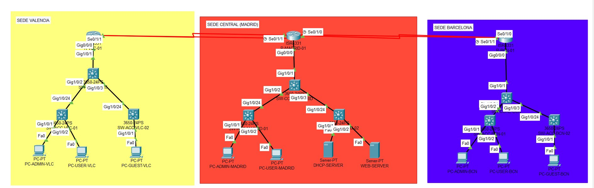

```
                    HEADQUARTERS (MADRID)
                       R-MADRID-01
                      /            \
                Se0/1/0            Se0/1/1
               10.0.0.1            10.0.1.1
                  |                    |
               10.0.0.2            10.0.1.2
               Se0/1/0             Se0/1/0
            R-BCN-01               R-VLC-01
            Se0/1/1 ————————————— Se0/1/1
            10.0.2.1               10.0.2.2

Each router connected to its SW-CORE via Gi0/0/0 (trunk)
Each SW-CORE connected to 2 SW-ACC via Gi1/0/2 and Gi1/0/3
Uplink SW-ACC → SW-CORE on Gi1/0/24
```

---

## Devices

| Device | Model | Site | Role |
|---|---|---|---|
| R-MADRID-01 | Cisco ISR 4331 | Madrid | Router-on-a-stick, DHCP relay, OSPF |
| R-BCN-01 | Cisco ISR 4331 | Barcelona | Router-on-a-stick, DHCP relay, OSPF |
| R-VLC-01 | Cisco ISR 4331 | Valencia | Router-on-a-stick, DHCP relay, OSPF |
| SW-CORE-MADRID | Cisco 3650-24PS | Madrid | Core switch, trunk links |
| SW-CORE-BCN | Cisco 3650-24PS | Barcelona | Core switch, trunk links |
| SW-CORE-VLC | Cisco 3650-24PS | Valencia | Core switch, trunk links |
| SW-ACC-MADRID-01 | Cisco 3650-24PS | Madrid | Access switch VLAN 10 & 20 |
| SW-ACC-MADRID-02 | Cisco 3650-24PS | Madrid | Access switch VLAN 30 (servers) |
| SW-ACC-BCN-01 | Cisco 3650-24PS | Barcelona | Access switch VLAN 10 & 20 |
| SW-ACC-BCN-02 | Cisco 3650-24PS | Barcelona | Access switch VLAN 40 |
| SW-ACC-VLC-01 | Cisco 3650-24PS | Valencia | Access switch VLAN 10 & 20 |
| SW-ACC-VLC-02 | Cisco 3650-24PS | Valencia | Access switch VLAN 40 |
| DHCP-SERVER | Server-PT | Madrid | Centralized DHCP server |
| WEB-SERVER | Server-PT | Madrid | Web server |

---

## IP Addressing

### WAN Serial links

| Link | Network | Router A | Router B |
|---|---|---|---|
| Madrid ↔ Barcelona | 10.0.0.0/30 | 10.0.0.1 (Se0/1/0) | 10.0.0.2 (Se0/1/0) |
| Madrid ↔ Valencia | 10.0.1.0/30 | 10.0.1.1 (Se0/1/1) | 10.0.1.2 (Se0/1/0) |
| Barcelona ↔ Valencia | 10.0.2.0/30 | 10.0.2.1 (Se0/1/1) | 10.0.2.2 (Se0/1/1) |

> /30 is used because point-to-point links only need 2 usable IPs.

### VLANs per site

| VLAN | Name | Madrid | Barcelona | Valencia |
|---|---|---|---|---|
| 10 | Admin | 192.168.10.0/24 | 192.168.50.0/24 | 192.168.90.0/24 |
| 20 | Users | 192.168.20.0/24 | 192.168.60.0/24 | 192.168.100.0/24 |
| 30 | Servers | 192.168.30.0/24 | 192.168.70.0/24 | 192.168.110.0/24 |
| 40 | Guests | 192.168.40.0/24 | 192.168.80.0/24 | 192.168.120.0/24 |

### Gateways per site

| Site | VLAN 10 GW | VLAN 20 GW | VLAN 30 GW | VLAN 40 GW |
|---|---|---|---|---|
| Madrid | 192.168.10.1 | 192.168.20.1 | 192.168.30.1 | 192.168.40.1 |
| Barcelona | 192.168.50.1 | 192.168.60.1 | 192.168.70.1 | 192.168.80.1 |
| Valencia | 192.168.90.1 | 192.168.100.1 | 192.168.110.1 | 192.168.120.1 |

### Static IPs

| Device | IP | VLAN |
|---|---|---|
| DHCP-SERVER | 192.168.30.10 | 30 |
| WEB-SERVER | 192.168.30.11 | 30 |

---

## Configuration

### 1. WAN Serial interfaces and VLAN subinterfaces

> The **NIM-2T** module must be added to each ISR 4331 before powering it on (Physical tab → power off → drag module → power on).

> DCE ends of each Serial link require `clock rate 64000`. Identify them with `show controllers SerialX/X/X`.

**R-MADRID-01 — DCE on Se0/1/0 and Se0/1/1:**
```cisco
interface Serial0/1/0
 ip address 10.0.0.1 255.255.255.252
 clock rate 64000
 description WAN-R-BCN-01
 no shutdown

interface Serial0/1/1
 ip address 10.0.1.1 255.255.255.252
 clock rate 64000
 description WAN-R-VLC-01
 no shutdown

interface GigabitEthernet0/0/0
 no shutdown
 description TRUNK-SW-CORE-MADRID

interface GigabitEthernet0/0/0.10
 encapsulation dot1Q 10
 ip address 192.168.10.1 255.255.255.0
 description GATEWAY-VLAN10-Admin

interface GigabitEthernet0/0/0.20
 encapsulation dot1Q 20
 ip address 192.168.20.1 255.255.255.0
 description GATEWAY-VLAN20-Users

interface GigabitEthernet0/0/0.30
 encapsulation dot1Q 30
 ip address 192.168.30.1 255.255.255.0
 description GATEWAY-VLAN30-Servers

interface GigabitEthernet0/0/0.40
 encapsulation dot1Q 40
 ip address 192.168.40.1 255.255.255.0
 description GATEWAY-VLAN40-Guests
```

**R-BCN-01 — DCE on Se0/1/1:**
```cisco
interface Serial0/1/0
 ip address 10.0.0.2 255.255.255.252
 description WAN-R-MADRID-01
 no shutdown

interface Serial0/1/1
 ip address 10.0.2.1 255.255.255.252
 clock rate 64000
 description WAN-R-VLC-01
 no shutdown

interface GigabitEthernet0/0/0
 no shutdown
 description TRUNK-SW-CORE-BCN

interface GigabitEthernet0/0/0.10
 encapsulation dot1Q 10
 ip address 192.168.50.1 255.255.255.0
 description GATEWAY-VLAN10-Admin

interface GigabitEthernet0/0/0.20
 encapsulation dot1Q 20
 ip address 192.168.60.1 255.255.255.0
 description GATEWAY-VLAN20-Users

interface GigabitEthernet0/0/0.30
 encapsulation dot1Q 30
 ip address 192.168.70.1 255.255.255.0
 description GATEWAY-VLAN30-Servers

interface GigabitEthernet0/0/0.40
 encapsulation dot1Q 40
 ip address 192.168.80.1 255.255.255.0
 description GATEWAY-VLAN40-Guests
```

**R-VLC-01:**
```cisco
interface Serial0/1/0
 ip address 10.0.1.2 255.255.255.252
 description WAN-R-MADRID-01
 no shutdown

interface Serial0/1/1
 ip address 10.0.2.2 255.255.255.252
 description WAN-R-BCN-01
 no shutdown

interface GigabitEthernet0/0/0
 no shutdown
 description TRUNK-SW-CORE-VLC

interface GigabitEthernet0/0/0.10
 encapsulation dot1Q 10
 ip address 192.168.90.1 255.255.255.0
 description GATEWAY-VLAN10-Admin

interface GigabitEthernet0/0/0.20
 encapsulation dot1Q 20
 ip address 192.168.100.1 255.255.255.0
 description GATEWAY-VLAN20-Users

interface GigabitEthernet0/0/0.30
 encapsulation dot1Q 30
 ip address 192.168.110.1 255.255.255.0
 description GATEWAY-VLAN30-Servers

interface GigabitEthernet0/0/0.40
 encapsulation dot1Q 40
 ip address 192.168.120.1 255.255.255.0
 description GATEWAY-VLAN40-Guests
```

### 2. OSPF — Area 0

OSPF allows the 3 routers to automatically discover all networks in the infrastructure. Each router advertises its WAN networks and local VLANs in Area 0 (backbone).

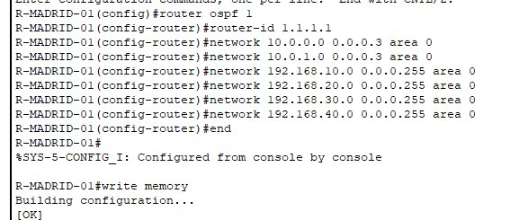

**R-MADRID-01:**
```cisco
router ospf 1
 router-id 1.1.1.1
 network 10.0.0.0 0.0.0.3 area 0
 network 10.0.1.0 0.0.0.3 area 0
 network 192.168.10.0 0.0.0.255 area 0
 network 192.168.20.0 0.0.0.255 area 0
 network 192.168.30.0 0.0.0.255 area 0
 network 192.168.40.0 0.0.0.255 area 0
```

**R-BCN-01:**
```cisco
router ospf 1
 router-id 2.2.2.2
 network 10.0.0.0 0.0.0.3 area 0
 network 10.0.2.0 0.0.0.3 area 0
 network 192.168.50.0 0.0.0.255 area 0
 network 192.168.60.0 0.0.0.255 area 0
 network 192.168.70.0 0.0.0.255 area 0
 network 192.168.80.0 0.0.0.255 area 0
```

**R-VLC-01:**
```cisco
router ospf 1
 router-id 3.3.3.3
 network 10.0.1.0 0.0.0.3 area 0
 network 10.0.2.0 0.0.0.3 area 0
 network 192.168.90.0 0.0.0.255 area 0
 network 192.168.100.0 0.0.0.255 area 0
 network 192.168.110.0 0.0.0.255 area 0
 network 192.168.120.0 0.0.0.255 area 0
```

### 3. Switches — VLANs, access and trunk

Applied on all 9 switches:

```cisco
vlan 10
 name Admin
vlan 20
 name Users
vlan 30
 name Servers
vlan 40
 name Guests
```

Trunk SW-CORE toward router and access switches:

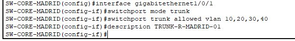

```cisco
interface GigabitEthernet1/0/1
 switchport mode trunk
 switchport trunk allowed vlan 10,20,30,40
 description TRUNK-ROUTER

interface GigabitEthernet1/0/2
 switchport mode trunk
 switchport trunk allowed vlan 10,20,30,40
 description TRUNK-SW-ACC-01

interface GigabitEthernet1/0/3
 switchport mode trunk
 switchport trunk allowed vlan 10,20,30,40
 description TRUNK-SW-ACC-02
```

Trunk uplink on all SW-ACC:
```cisco
interface GigabitEthernet1/0/24
 switchport mode trunk
 switchport trunk allowed vlan 10,20,30,40
 description TRUNK-SW-CORE
```

### 4. Centralized DHCP and relay

The DHCP server in Madrid (192.168.30.10) serves all sites. The `ip helper-address` on each subinterface forwards DHCP requests to the server across different networks.

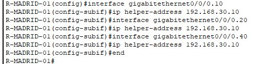

Applied on all 3 routers (except subinterface .30):
```cisco
interface GigabitEthernet0/0/0.10
 ip helper-address 192.168.30.10

interface GigabitEthernet0/0/0.20
 ip helper-address 192.168.30.10

interface GigabitEthernet0/0/0.40
 ip helper-address 192.168.30.10
```

DHCP pools configured on DHCP-SERVER (Services → DHCP):

| Pool | Gateway | DNS | Start IP | Max |
|---|---|---|---|---|
| MADRID-VLAN10 | 192.168.10.1 | 192.168.30.10 | 192.168.10.10 | 90 |
| MADRID-VLAN20 | 192.168.20.1 | 192.168.30.10 | 192.168.20.10 | 90 |
| MADRID-VLAN40 | 192.168.40.1 | 192.168.30.10 | 192.168.40.10 | 40 |
| BCN-VLAN10 | 192.168.50.1 | 192.168.30.10 | 192.168.50.10 | 90 |
| BCN-VLAN20 | 192.168.60.1 | 192.168.30.10 | 192.168.60.10 | 90 |
| BCN-VLAN40 | 192.168.80.1 | 192.168.30.10 | 192.168.80.10 | 40 |
| VLC-VLAN10 | 192.168.90.1 | 192.168.30.10 | 192.168.90.10 | 90 |
| VLC-VLAN20 | 192.168.100.1 | 192.168.30.10 | 192.168.100.10 | 90 |
| VLC-VLAN40 | 192.168.120.1 | 192.168.30.10 | 192.168.120.10 | 40 |

### 5. Port Security

Applied on all SW-ACC access ports. Mode `restrict` logs violations without interrupting service:

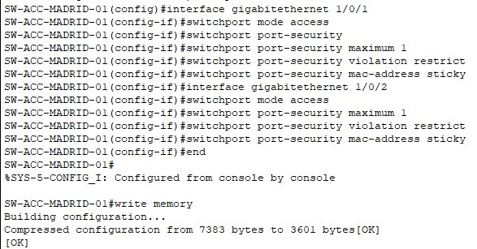

```cisco
interface GigabitEthernet1/0/1
 switchport mode access
 switchport port-security
 switchport port-security maximum 1
 switchport port-security violation restrict
 switchport port-security mac-address sticky

interface GigabitEthernet1/0/2
 switchport mode access
 switchport port-security
 switchport port-security maximum 1
 switchport port-security violation restrict
 switchport port-security mac-address sticky
```

---

## Verification

### OSPF neighbors — R-MADRID-01

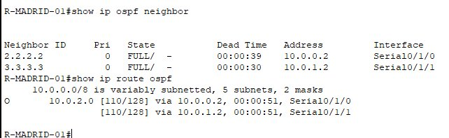

### OSPF neighbors and routes — R-VLC-01

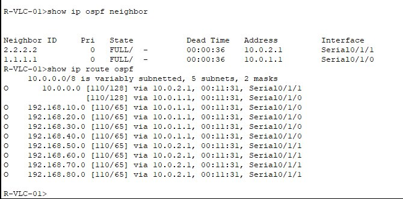

### OSPF routes — R-MADRID-01

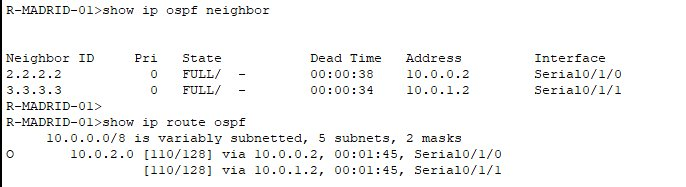

### Ping Madrid → Barcelona

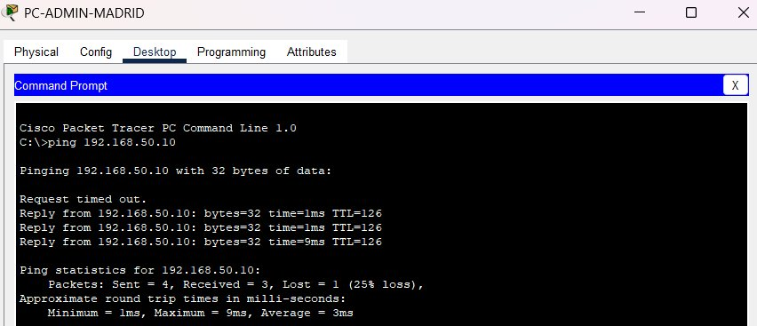

### Ping Barcelona → Madrid and Valencia

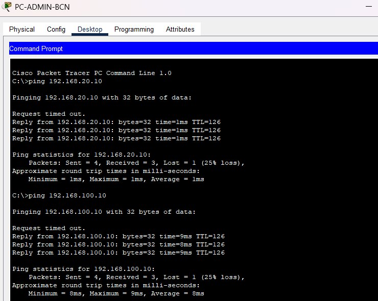

### Ping Valencia → Madrid and Barcelona

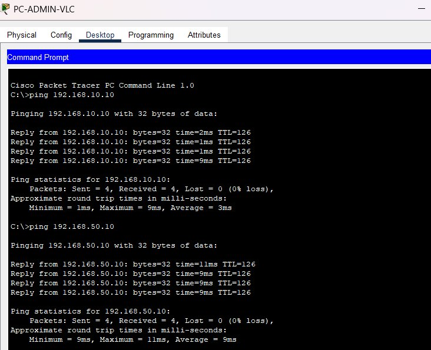

### Port Security

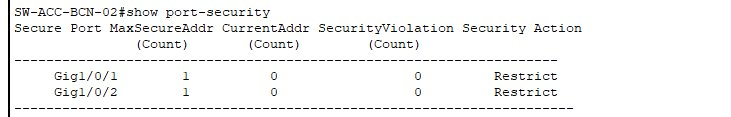

### Expected results

| Test | Expected output |
|---|---|
| `show ip ospf neighbor` | FULL with both neighbors on each router |
| `show ip route ospf` | O routes from the other 2 sites |
| Inter-site ping | Reply from all sites |
| DHCP per site | Correct IP from the right pool |
| `show port-security` | Secure-up, Restrict mode |

> The first dropped packet in each ping is expected — it corresponds to the initial ARP resolution.

---

## Troubleshooting

**Issue:** Serial links were not coming up.
**Root cause:** `clock rate` was missing on the DCE ends.
**Fix:** Identified DCE ends with `show controllers SerialX/X/X` and added `clock rate 64000`.

---

**Issue:** PCs in Barcelona and Valencia were not receiving an IP via DHCP.
**Root cause:** `ip helper-address` was not configured on the remote routers.
**Fix:** Added `ip helper-address 192.168.30.10` on subinterfaces .10, .20 and .40 of R-BCN-01 and R-VLC-01. The relay works because OSPF routes allow reaching the DHCP server in Madrid.

---

*Lab built with Cisco Packet Tracer 8.x — Daniel Moisés Loyo Vásquez*
